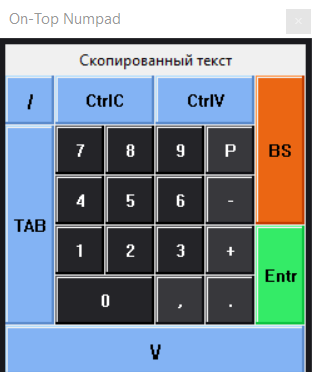

# Ontop Keyboard  

## Описание проекта  
On-Top Keyboard — это Win32-приложение, реализованное на C++ с использованием Win32 API.  
Главные особенности:  
- Создание наэкранной клавиатуры с кастомными кнопками и цветовым оформлением.  
- Встроенная работа с буфером обмена (отображение и копирование текста).  
- Использование встроенных ресурсов (иконка в трее) через секцию ресурсов бинарного файла.  
- Поддержка трей-иконки с контекстным меню (свернуть/восстановить/закрыть).  
- Встроенный серверный сокет для вызова функциональности выбора папки и последовательная загрузка файлов.  
- Поддержка DPI-скейлинга и динамической подстройки размеров элементов интерфейса.  

Проект также служил практикой в освоении Windows пайпланйна, включая использование CMake + Ninja + Clang + llvm-rc для сборки Win32-приложений.  

## Примеры работы


## Сборка проекта  

### Требования  
- CMake ≥ 3.30  
- Ninja  
- Clang/LLVM toolchain (включая clang, clang++, llvm-rc)  
- Windows SDK (для win32-заголовков и библиотек)  

### Инструкции по сборке  
1. Клонировать репозиторий:
```
git clone https://github.com/kuzicki/ontop_keyboard
cd ontop_keyboard
```  

2. Создать папку для сборки и перейти в неё:
```
mkdir build  
cd build
```  

3. Сконфигурировать проект с помощью CMake:
``` 
cmake -G Ninja -DCMAKE_BUILD_TYPE=Release ..
``` 
Или же можно сконфигурировать в Debug режиме:
```  
cmake -G Ninja -DCMAKE_BUILD_TYPE=Debug ..
```  

4. Запустить сборку:
```  
ninja
```  

5. Готовый исполняемый файл появится в build/ontop_keyboard.exe.  

## Запуск  
Запуск осуществляется напрямую:
```  
./ontop_keyboard.exe
```  

После запуска:  
- Приложение отображает окно с клавиатурой.  
- При сворачивании окно скрывается и иконка появляется в системном трее.  
- Через правый клик на трей-иконке доступно меню для восстановления или выхода.  
- Фоновый сокет-сервер ожидает запросов для выполнения задач (например, выбор папки и поочередная отправка файлов).  

### Чему я научился  
Работая над этим проектом, я:  
- Освоил практику работы с Win32 API (окна, кнопки, меню, буфер обмена, треи).  
- Научился встраивать ресурсы (иконки, меню) в бинарный файл.  
- Освоил CMake + Ninja + Clang как инструмент сборки под Windows.  
- Разобрался с линковкой Win32-приложений и использованием llvm-rc.  
- Реализовал взаимодействие через сокеты для выполнения команд из внешних источников.  
